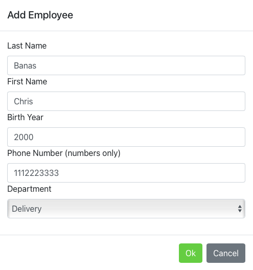
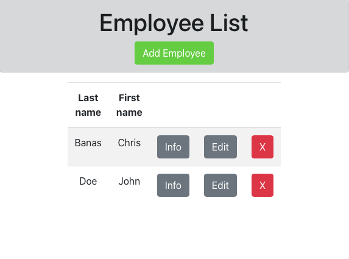

# ManagerSystem
Full stack project using ReactJS, Python, Flask, and Rest to create a 
website that allows employers to see an editable table full of employee information.

When the server and website are running, the user interacts with the website to store
information on a local database. The server and website interact with each other to
display the database's information in an easy to view format.

## Images
Inputting data

Outputted data

## System Requirements / Installation
- Python installed on system
- Flask & flask_restful installed on python version
- Node.js installed on system
- Empty localhost:3000 (website) and localhost:5000 (server)

## Running Project
- Starting server
    - Set directory to ManagerSystem/server directory
    - Run server.py file with command "python3 server.py"
    - Output should show flask has started
        - If not, try command "python server.py"
- Starting website
    - Set directory to ManagerSystem
    - Run command "npm start" to run the react project
    - Website should open up a browser with the page
        - If not, navigate to localhost:3000 in a browser

## Possible Improvements
- Filter option on table
- Search option
- Improve the User Interface
- Reformat code in edit button to improve code quality

## Authors and Acknowledgment

Some code based off of files provided to students at the Rochester Institute of Technology
for Web Engineering (SWEN-344)